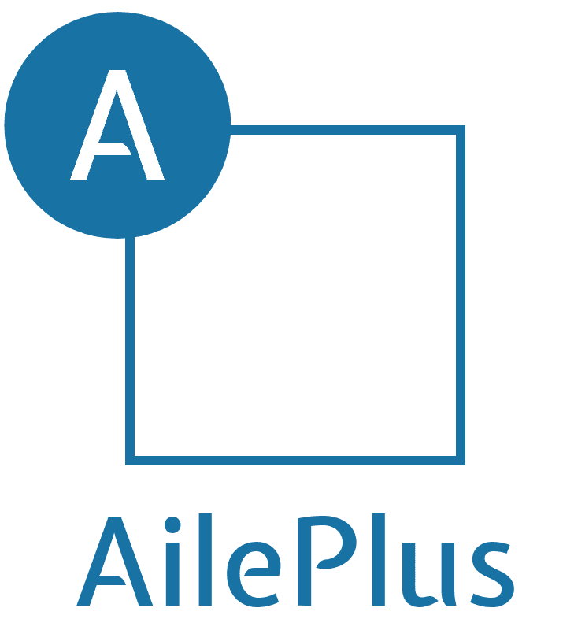

<p align="center">
  
</p>

<p align="center">
  <a href="https://www.npmjs.org/package/aile-plus">
    
  </a>
  <a href="https://npmcharts.com/compare/aile-plus?minimal=true">
    
  </a>
  <a href="LICENSE">
    
  </a>
</p>

## Features

`AilePlus` 是一个基于 [Vue 3.0](https://v3.vuejs.org/) 和 [Element Plus](https://element-plus.org/) 进行二次开发的UI库，包含以下常用组件：

- [Autocomplete 带输入建议的输入框](./lib/autocomplete/README.md)
- [Avatar 头像](./lib/avatar/README.md)
- [Card 卡片容器](./lib/card/README.md)
- [Dialog 对话框](./lib/dialog/README.md)
- [Form 表单](./lib/form/README.md)
- [Input 输入框](./lib/input/README.md)
- [Link 链接](./lib/link/README.md)
- [Placement 占位图片](./lib/placement/README.md)
- [Select 下拉选择器](./lib/select/README.md)
- [Table 表格](./lib/table/README.md)
- [Tooltip 提示框](./lib/tooltip/README.md)

每种组件均在原有 `ElementPlus` 的基础上进行了功能增强，例如 `Form` 和 `Table` 组件实现了配置化开发，可通过书写JSX语法传入 `column` 属性完成配置，而 `Select` 和 `Autocomplete` 组件则实现了无限滚动加载的功能，更多功能可点击上方列表阅读相应 `README.md` 文档

## Install

通过 `npm` 或者 `yarn` 安装项目

```bash
npm i aile-plus element-plus

# 或者
yarn add aile-plus element-plus
```

## Quick Start

引用组件，根据需要可全局引入或者局部引入
注意：由于 `AilePlus` 是基于 `ElementPlus` 进行的二次开发，因此需全局引入 `ElementPlus` 组件后方可正常使用

`main.js` 全局引入

```js
import { createApp } from 'vue'
import App from './App.vue'
import ElementPlus from 'element-plus'
import 'element-plus/lib/theme-chalk/index.css';

const app = createApp(App)
app.use(ElementPlus)

// 方式1：引入全部组件包并设置参数，key的名称是组件类别
import AilePlus from 'aile-plus'
app.use(AilePlus, {
  autocomplete: {
    clearable: true,
    config: {
      trim: true
    }
  }
})

// 方式2：引入单独组件并设置参数
import AileAutocomplete from 'aile-plus/lib/autocomplete'
app.use(AileAutocomplete, {
  clearable: true,
  config: {
    trim: true
  }
});
```

`Demo.vue` 局部引入

```js
import AileAutocomplete from 'aile-plus/lib/autocomplete'
export default {
    components: {
        AileAutocomplete
    }
}
```
